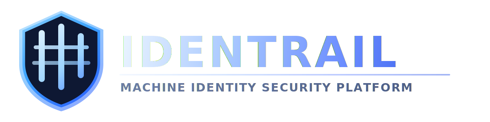

  

  <strong>Machine Identity Security for Cloud and Kubernetes</strong>

  <a href="docs/architecture.md">Architecture</a> ·
  <a href="docs/deployment-anywhere.md">Deployment</a> ·
  <a href="docs/openapi-v1.yaml">API Contract</a> ·
  <a href="SECURITY.md">Security Policy</a> ·
  <a href="CONTRIBUTING.md">Contributing</a>

Identrail helps teams:
- discover unmanaged machine and workload identities
- find overprivileged or risky access paths before attackers do
- reduce blast radius with clear, actionable remediation guidance
- improve audit readiness with consistent identity risk visibility over time

Business outcome: fewer identity-driven incidents, faster remediation cycles, and stronger security posture at lower operational cost.
